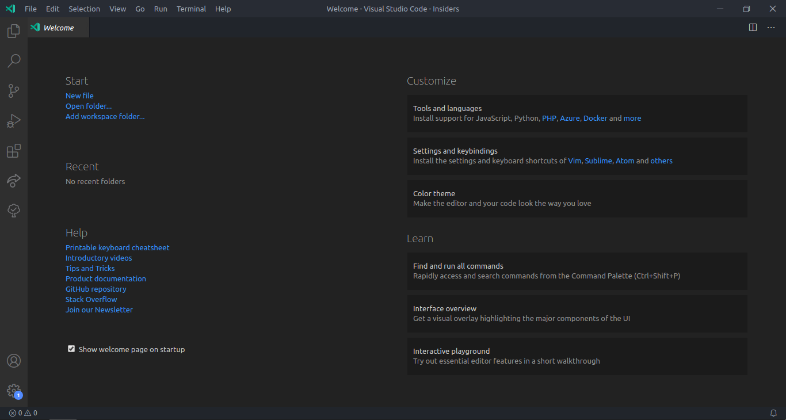
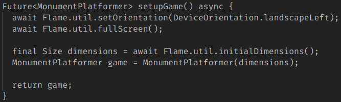
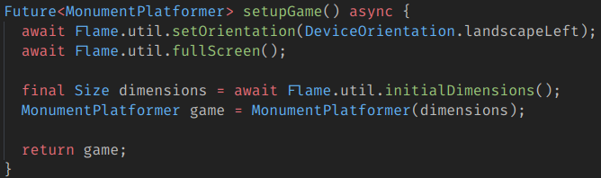
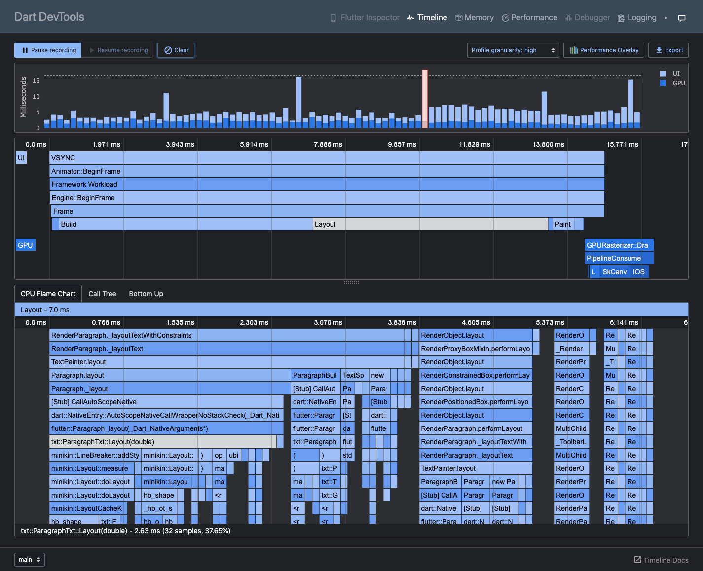
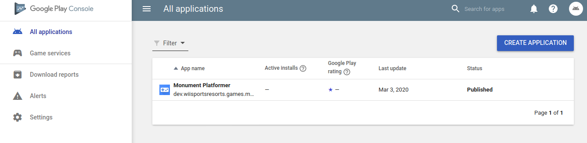
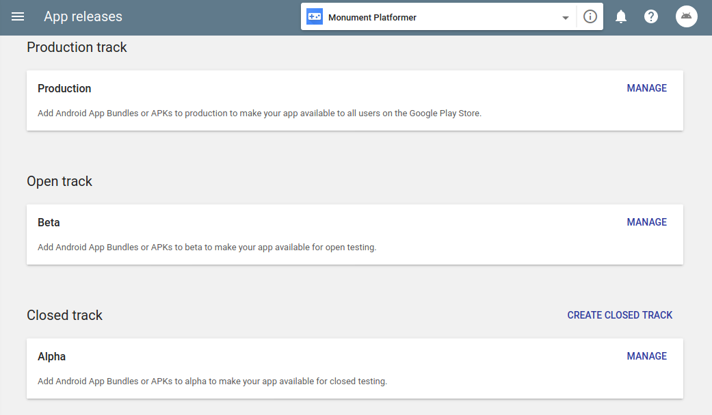
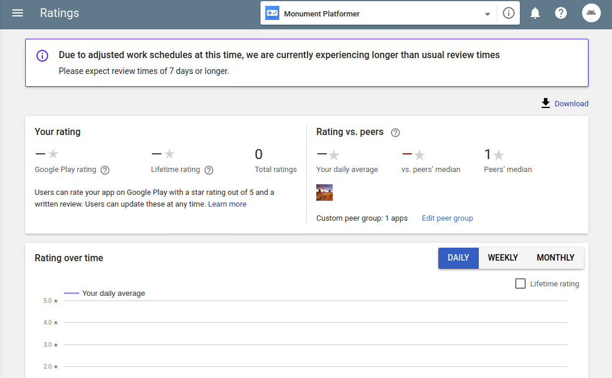
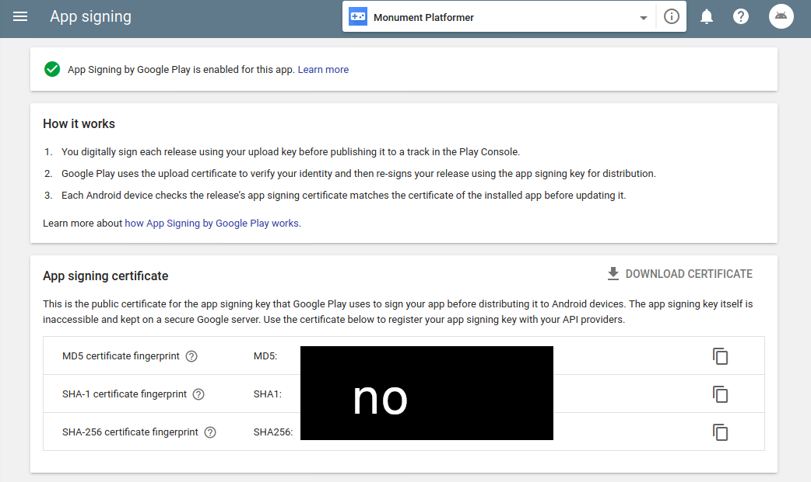

# Capstone Blog - Week 4

This week, we're writing our blog on GitHub! The editor here provides a lot more freedom than the KidBlog editor. This document is written in a markup language called **Markdown**. See the raw markup by clicking `Raw` in the top right corner of this document.

Other progress this week:

- Polishing physics and graphics
- Save data testing

In this post, we'll be talking about our workflow (how we code, test, and publish our game).

## Writing code

To write code, you _probably could_ use a normal text editor, like Notepad, TextEdit, or even _Google Docs_, but a well-suited IDE (integrated development environment) will make your life a thousand times easier. From syntax highlighting to keyboard shortcuts and refactoring (large and/or tedious changes in code), and IDE simplifies the editing process so that you can write code faster and more efficiently.

We use an IDE called [Visual Studio Code](https://code.visualstudio.com) (or VS Code for short). It's powerful, yet lightweight, and it's packed with features. Other great choices include [Android Studio](https://developer.android.com/studio) and [IntelliJ IDEA](https://www.jetbrains.com/idea/).

_VS Code interface_  

A proper editor can take out a lot of the headache that comes with reading lots and lots of text. You can go from this:

_Non-highlighted Dart code_  

To this:

_Highlighted Dart code_  

On its own, it won't be able to do much (it's still just a fancy text editor), and that's where extensions and SDKs come in. For our case, we'll need the [Flutter](https://marketplace.visualstudio.com/items?itemName=Dart-Code.flutter) and [Dart](https://marketplace.visualstudio.com/items?itemName=Dart-Code.dart-code) extensions to be able to work with Dart code and the [Flutter SDK](https://flutter.dev/getting-started) in order to compile and run our app on a device.

_Flutter VS Code extension_  
_Image from <https://github.com/Dart-Code/Flutter>_  

## Testing and debugging

Flutter apps can be tested using a device emulator or a physical device. A feature called Hot Reload allows an app to be updated on-the-fly with new code (see above GIF). This makes testing super easy and quick. The debugger in VS Code can catch exceptions and pause execution so you have a change to read it before it flies past in the console. It also offers a neat inspector called Dart DevTools.

_Dart DevTools performace inspector_  
_Image from <https://flutter.dev/docs/development/tools/devtools/overview>_

## Deploying apps

Our game will be published to the Android market through the Google Play Store. We won't be publishing on the Apple App Store becuase of its high publisher fees ($25 onetime for GP, $99/yr for Apple).

_Google Play Console_  

The console is where most marketing and publishing tools live.

_Release management_  

_Ratings dashboard_  

For security reasons, all bundles of the game are signed with a key that only we have to prove that the app hasn't been tampered with after release. This prevents hackers from injecting scripts into the game, as that would modify the hash (digest) of the bundle and prevent the app from being verified again using the key. Google's servers handles this automatically, so all we have to do is upload a signed APK file and we're good to go!

_App signing dashboard_  

Once published, users can download the signed app from the Play Store. We will read reviews and repeat the development cycle of developing, testing, and publishing new features for our game.

That's all for this week. We'll be contacting professionals next blog.

---

© 2020 gamer-gang under [CC BY 4.0](https://creativecommons.org/licenses/by/4.0/)
