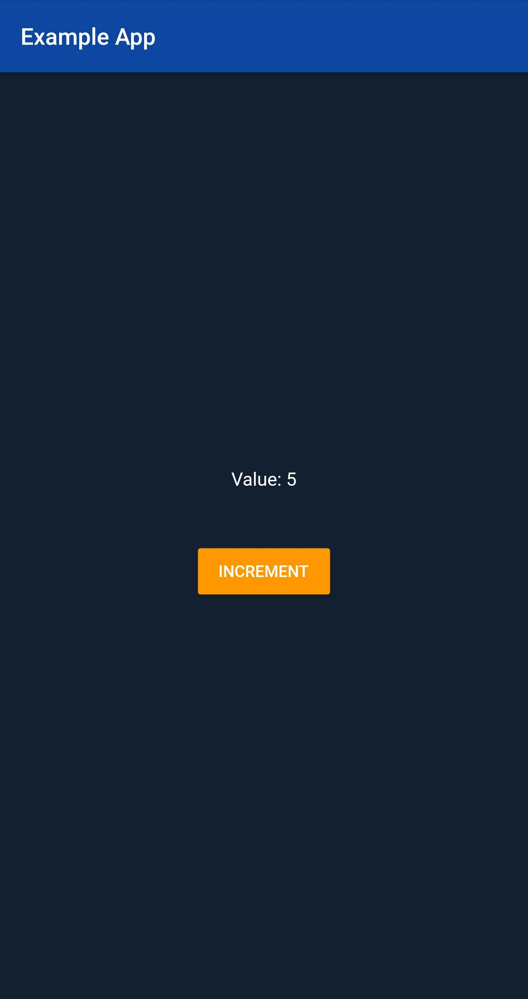
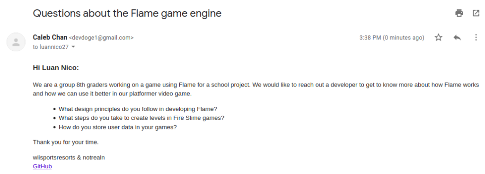
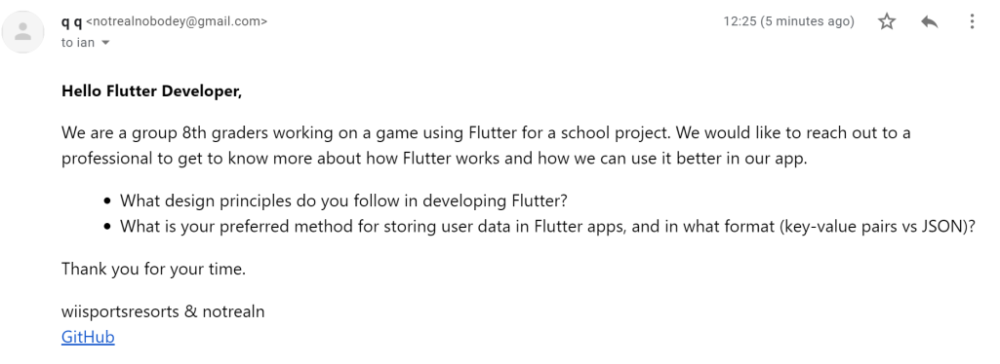

# Capstone Blog - Week 5

This week, we contacted 2 professionals: one from the Flame development team, and one from the Flutter development team. We've also started looking deeper into the documentation of each. I guess that's the deliverable.

## Reading all the docs

Flutter docs: <https://api.flutter.dev>

The Flutter docs provide information on creating, rendering, and updating widgets in the app. We have learned how to create both stateless and stateful widgets using classes.

We made an example app that you can follow along with using the comments.
Go to <https://codepen.io/wiisportsresorts/pen/PoPBazv> to see the code and test it out.

*App preview*

The Flame docs can be found at <https://flame-engine.org/docs/>; it provides information about instantiating a game, sprites, and other game-specific things.

## Emails

We contacted some professionals:

Luan Nico, lead Flame devloper:

and Ian Hickson, a large contributor to Flutter:

That's all for now. Hopefully we get a response soon.

---

© 2020 gamer-gang under [CC BY 4.0](https://creativecommons.org/licenses/by/4.0/)
