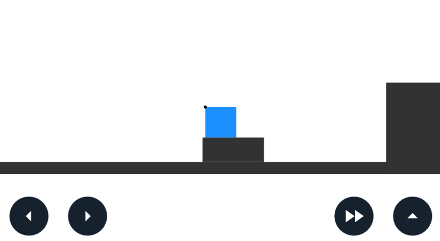
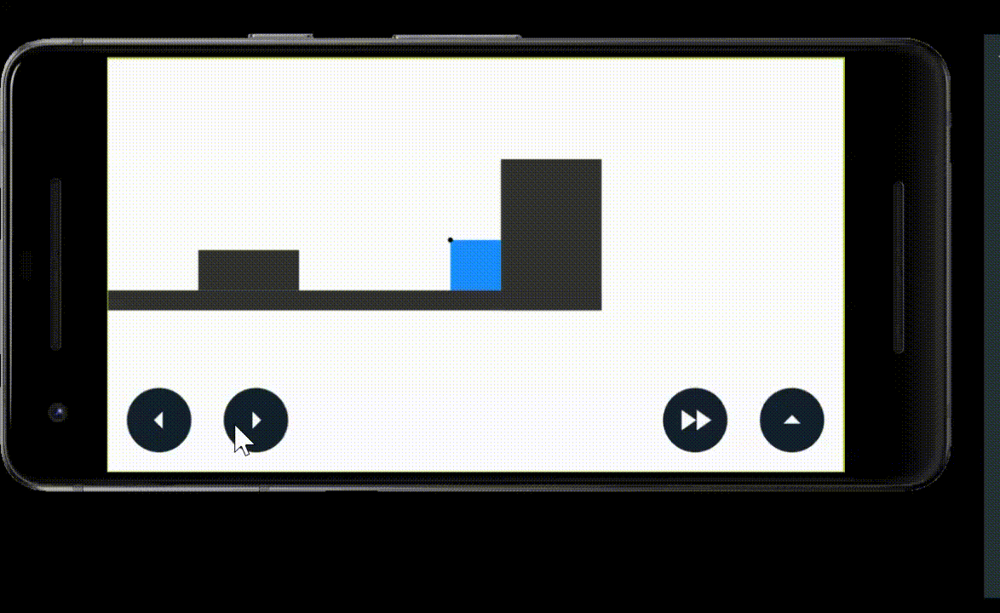

#Blog 6

Hey all, for the past few days ive been working on the game. I've got some new exiting stuff you will be able to play with when the game comes out. 

##Levels
I have made a bit of a tutorial level. It still needs a bit of text to tell you what to do, but I can add that later. 

##Better physics
Last time, the jumping physics were pretty wack. Instead of having 2 jumps, you had 3. Also sometimes your jump would not jump very high. These things got fixed in this version. 

##Other things
I added a bit of code for having different backgrounds and foregrounds. We plan to use [parallax](https://en.wikipedia.org/wiki/Parallax) to make things in our game look nicer. 

Thats all for this update. The code took like 5 hours to make. 
